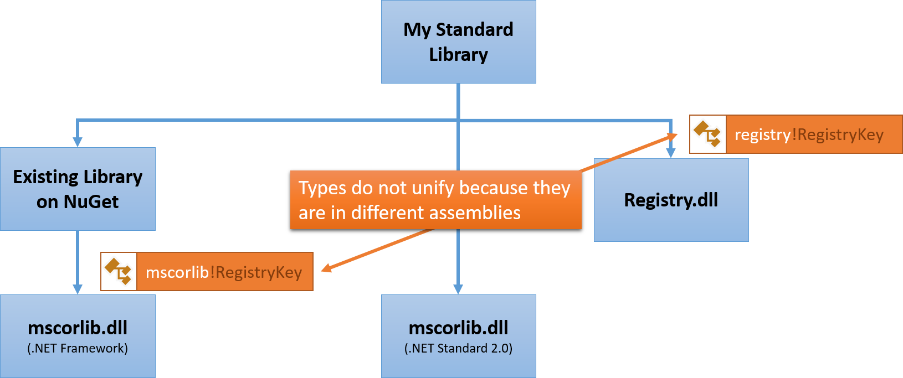
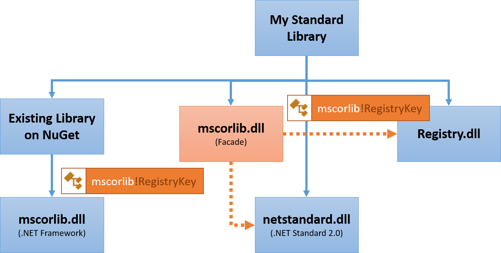

# .NET Standard 2

This document describes the plan for .NET Standard 2, which includes the
definition of its API surface as well as the principles we use to extend and
review those additions.

## Goals

* **Driving force for consistency**. We want to have an agreed upon set of
  required APIs that all .NET platforms have to implement in order to get access
  to the .NET library ecosystem.

* **Foundation for great cross-platform tooling**. We want a simplified tooling
  experience in Visual Studio and the command line that allows customers to
  target the commonality of all .NET platforms by choosing a single version
  number.

## Customer Scenarios

These are the scenarios we need to be able to support with .NET Standard 2:

* **Wide .NET Standard support**. Stacey builds a .NET Standard-based library.
  She can consume the library from all current platforms.
* **Meet our ecosystem where it is**. Paul can consume an `mscorlib` based
  assembly from a .NET Standard-based library without having to jump through
  hoops.
* **No PCL left behind**. Dakota can consume a PCL based assembly from a .NET
  Standard-based library without having to jump through hoops.
* **Avoid cliffs**. Ariel can extend a .NET Standard-based library to use
  components that aren’t available everywhere without having to cross-compile.

## Requirements

The scenarios above result in these requirements:

* **100% source and binary compatible** surface area for:
    - Classic .NET Framework and Xamarin assemblies (`mscorlib` and friends)
    - Existing portable class libraries (both, mscorlib as well as `System.Runtime`)
* Binary compatibility refers to binding compat, but an understanding that
  **behavioral compatibility may not be 100% possible**.
* We’ll not necessarily bring all the types that .NET Framework has, but that
  **we’ll bring types in their entirety without subsetting members**.
* Focus on APIs that are available everywhere, but
  **allow for platform specific extensions**.

## Assembly Unification

Given these requirements, .NET Standard will have to support the following
assembly sets:

* We'll have support for `mscorlib` and friends
* We'll have support for `System.Runtime` and friends

Of course, we can't have two assemblies defining the same type; thus we have to
pick one home for a given type and have the other assembly type forward to it.
At first, it seems quite attractive to have the core assembly called `mscorlib`.
We don't want to use `System.Runtime` as the goal of .NET Standard is to replace
the current version of PCLs and contracts.

However, we can't call the core assembly `mscorlib`. The reason being that we
have two conflicting requirements:

1. We want to be able to consume existing binaries and have the APIs unify in
   .NET Standard, assuming the API is supported in .NET Standard.
2. We also want to be able to model platform specific APIs without forcing
   all platform owners to provide the API.

Let's look at a concrete example. Assume I'm writing a class library that is
targeting .NET Standard. Assume I'm only targeting Windows and thus want to
use the registry. Since the registry is an extension, it sits on top of .NET
Standard. Now I want to reuse a library that was compiled against the .NET
Framework and only uses APIs .NET Standard has, plus the registry. This looks as
follows:

Unfortunately, we can't unify `mscorlib!RegistryKey` with `registry!RegistryKey`
as these have different identities.

Fortunately, this conflict can be easily resolved if we call the core assembly
something else, such as `netstandard.dll`:

***Legend***: *Dotted lines indicate type forwarding, solid lines indicate references*

This frees up the name `mscorlib` in .NET Standard and we can introduce an
assembly that simply type-forwards all its types to the appropriate location:

* Required types go to `netstandard.dll`
* Optional types go to `<extension>.dll`

### Assembly Sets

This means we've logically three assembly sets in .NET Standard:

1. The definition of the .NET Standard `netstandard.dll`
2. Type forwarders for the classic assemblies such as `mscorlib`
3. Type forwarders for the PCL contract assemblies such as `System.Runtime`

The developer will never explicitly have to interact with any of these sets. The
`netstandard.dll` will always be referenced. The build system will automatically
reference the type forwarding assemblies if the developer references a non-.NET
Standard class library.

Please note that the above sets do not include the extensions, such as the
registry. That is intentional. The .NET Standard only includes APIs that are
considered required, and thus must be supported by every platform.

Extensions exist outside of the .NET Standard and must be manually referenced.
This ensures that developers are aware if they start using functionality that
might limit the set of platforms their library can run on. We expect the
extensions to be provided as NuGet packages.

You might wonder how .NET Standard is self-contained if it has type forwarders
to assemblies that aren't part of .NET Standard, i.e. are forwarding to
extensions such as the registry. The answer is that the SDK that makes up the
.NET Standard is in fact not self-contained and points to extension assemblies.
Technically, dangling type forwarders aren't problematic and we have used them
in the past. If the developer references an assembly like above and starts
consuming an API that returns a type that lives in an extension, such as
`RegistryKey`, the compiler will emit an error message like this:

> CS0012: The type 'RegistryKey' is defined in an assembly that is not
> referenced. You must add a reference to assembly 'Microsoft.Win32.Registry,
> Version=4.0.0.0, Culture=neutral, PublicKeyToken=b77a5c561934e089'

Also, since Visual Studio 2015 Update 3 the Roslyn team added a quick fix that
will suggest missing NuGet packages when a type cannot be resolved. This will
also handle cases like the one above and thus allow the developer to fix the
issue right from the editor without having to know which NuGet package they
need. The key point is that developer will have to take an explicit action to
make the project less portable.

We'll provide another document that goes into more detail on how the user
experience in Visual Studio can be improved to make developers aware of
portability issues.

## .NET Framework 4.6.1 supporting .NET Standard 2.0

.NET Framework 4.6.1 has the highest adoption, which makes it the most
attractive version of .NET Framework to target.

By following normal versioning rules one would expect that .NET Standard 2.0
would only be supported by a newer version of .NET Framework, given that .NET
Framework 4.6.1 only implements .NET Standard 1.4.

This would mean that the libraries compiled against .NET Standard 2.0 would not
run on the vast majority of .NET Framework installations.

On the other hand, .NET Standard 2.0 adds many APIs that .NET Framework 4.6.1
already supports. The delta looks as follows:

* .NET Standard 2.0 adds **14,994 APIs** that .NET Framework 4.6.1 already
  supports
* .NET Standard 2.0 only has **43 APIs** that .NET Framework 4.6.1 doesn't
  support

Originally, we planned to simply elide those APIs from .NET Standard 2.0 in
order to make it easier to understand what will work on .NET Framework 4.6.1.

However, we got a lot of feedback around this. You told us that this decision
makes it really hard to reason about .NET Standard versioning rules. Thus, we
decided to simplify this:

* .NET Standard 2.0 will be a strict superset of .NET Standard 1.6. In other
  words, no breaking changes will happen between .NET Standard 2.0 and 1.x.
* .NET Framework 4.6.1 will allow referencing binaries that are compiled against
  .NET Standard 2.0.

Considering the number of APIs that .NET Framework 4.6.1 will not support is
low and that these are all brand-new APIs with low adoption we believe this is
a much better trade-off.

You can use API Port to scan a given application to make sure no code in your
application depends on these APIs.
